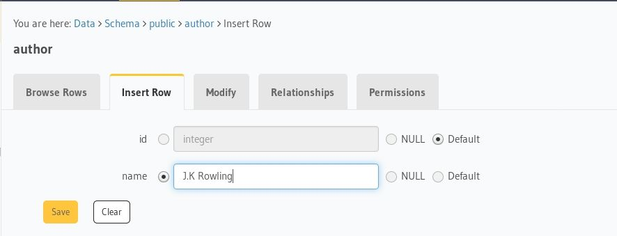
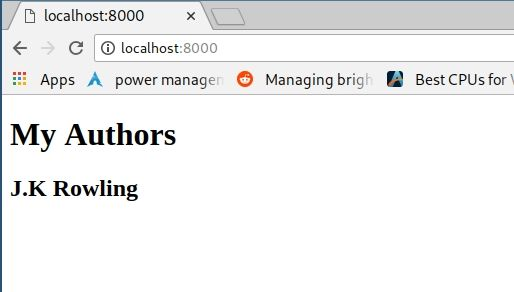

# gatsby-postgres-graphql

Boilerplate to get started with Gatsby, Hasura GraphQL engine as CMS and postgres as database using the awesome plugin [gatsby-source-graphql](https://github.com/gatsbyjs/gatsby/tree/master/packages/gatsby-source-graphql).

[](https://codesandbox.io/s/github/hasura/sample-apps/tree/main/gatsby-postgres-graphql?fontsize=14)


# Tutorial

- Deploy GraphQL Engine on Hasura Cloud and setup PostgreSQL via Heroku:
  
  [](https://cloud.hasura.io/signup)

- Get the Hasura app URL (say `gatsby-graphql.hasura.app`)

- Clone this repo:

```bash
git clone https://github.com/hasura/sample-apps
cd gatsby-postgres-graphql
```

- Create `author` table:

Open Hasura console: visit https://gatsby-graphql.hasura.app on a browser  
 Navigate to `Data` section in the top nav bar and create a table as follows:


- Insert sample data into `author` table:



Verify if the row is inserted successfully


- Install npm modules:

```bash
npm install
```

- Configure gatsby to use `gatsby-source-graphql` plugin and a connection GraphQL url to stitch the schema.

```js
{
  plugins: [
    {
      resolve: "gatsby-source-graphql", // <- Configure plugin
      options: {
        typeName: "HASURA",
        fieldName: "hasura", // <- fieldName under which schema will be stitched
        url: process.env.GATSBY_HASURA_GRAPHQL_URL,
        refetchInterval: 10 // Refresh every 10 seconds for new data
      }
    }
  ];
}
```

- Run the app:

```bash
GATSBY_HASURA_GRAPHQL_URL=https://gatsby-graphql.hasura.app/v1/graphql npm run develop
```

- Test the app
   Visit [http://localhost:8000](http://localhost:8000) to view the app



# Make a GraphQL query from your component using hooks

1. Create a component named `AuthorList.js`:

```js
import React from "react";
import { useQuery } from "@apollo/react-hooks";
import { gql } from "apollo-boost";

const GET_AUTHORS = gql`
  query {
    author {
      id
      name
    }
  }
`;

const AuthorList = () => {
  const { loading, error, data } = useQuery(GET_AUTHORS);

  if (loading) return "loading...";
  if (error) return `error: ${error.message}`;

  return (
    <div>
      {data.author.map((author, index) => (
        <div key={index}>
          <h2>{author.name}</h2>
        </div>
      ))}
    </div>
  );
};

export default AuthorList;
export { GET_AUTHORS };
```

# Make a GraphQL mutation using hooks

Additional packages are needed to be added to support mutations: <br/>
`npm install @apollo/react-hooks apollo-boost isomorphic-fetch`

1. Create an `apollo.js` util file:

```js
import ApolloClient from "apollo-boost";
import fetch from "isomorphic-fetch";

export const client = new ApolloClient({
  uri: process.env.GATSBY_HASURA_GRAPHQL_URL,
  fetch
});
```

2. Create `gatsby-browser.js` and `gatsby-ssr.js`

```js
import React from "react";
import { ApolloProvider } from "@apollo/react-hooks";
import { client } from "./src/utils/apollo";

export const wrapRootElement = ({ element }) => (
  <ApolloProvider client={client}>{element}</ApolloProvider>
);
```

3. Create an `AddAuthor.js` component to add mutations:

```js
import React, { useState } from "react";
import { useMutation } from "@apollo/react-hooks";
import { gql } from "apollo-boost";
import { GET_AUTHORS } from "./AuthorList";

const ADD_AUTHOR = gql`
  mutation insert_author($name: String!) {
    insert_author(objects: { name: $name }) {
      returning {
        id
        name
      }
    }
  }
`;

const AddAuthor = () => {
  const [author, setAuthor] = useState("");
  const [insert_author, { loading, error }] = useMutation(ADD_AUTHOR, {
    update: (cache, { data }) => {
      setAuthor("");
      const existingAuthors = cache.readQuery({
        query: GET_AUTHORS
      });

      // Add the new author to the cache
      const newAuthor = data.insert_author.returning[0];
      cache.writeQuery({
        query: GET_AUTHORS,
        data: {author: [newAuthor, ...existingAuthors.author]}
      });
    }
  });

  if (loading) return "loading...";
  if (error) return `error: ${error.message}`;

  const handleSubmit = event => {
    event.preventDefault();
    insert_author({
      variables: {
        name: author
      }
    });
  };

  return (
    <form onSubmit={handleSubmit}>
      <label htmlFor="author">
        Add Author:
        <input
          name="author"
          value={author}
          onChange={event => setAuthor(event.target.value)}
        />
      </label>
      <button type="submit">ADD</button>
    </form>
  );
};

export default AddAuthor;
```

4. Run the app and test mutation. New data will be added to the top via a cache update.

# Contributing

Checkout the [contributing guide](../../../CONTRIBUTING.md#community-content) for more details.
