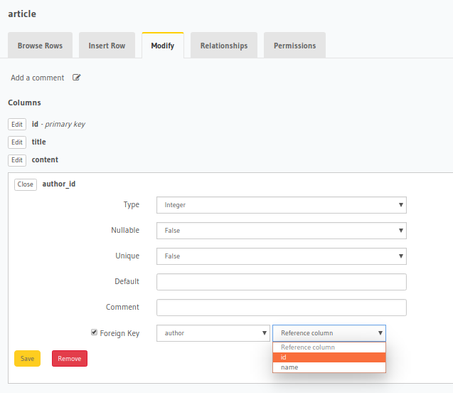

# gridsome-postgres-graphql

Boilerplate to get started with Gridsome, Hasura GraphQL Engine and PostgreSQL. It uses the Hasura GraphQL Engine as a CMS, PostgreSQL as a database and the [source-graphql](https://github.com/gridsome/gridsome/tree/master/packages/source-graphql) plugin.

[](https://codesandbox.io/s/github/hasura/sample-apps/tree/main/gridsome-postgres-graphql?fontsize=14)


# Tutorial Steps

- Deploy the GraphQL Engine on Hasura Cloud and setup PostgreSQL via Heroku:
  
  [](https://cloud.hasura.io/signup)
- Get the Hasura app URL (say `gridsome-graphql.hasura.app`)
- Create the `author` table:
  
  Open the Hasura console: visit https://gridsome-graphql.hasura.app in a browser
  Navigate to the `Data` section in the top nav bar and create a table as follows:

  

- Insert sample data into `author` table:

  

  Verify if the row is inserted successfully

  

- Similarly, create an `article` table with the following columns: `id`, `title`, `content`, `author_id` (foreign key to `author` table's `id`) and `created_at`

  

- Now create a relationship from the `article` table to the `author` table by going to the "Relationships" tab.

- Install the Gridsome CLI:

`npm install --global @gridsome/cli`

- Create a Gridsome project:

`gridsome create my-gridsome-site`

- Go to your project directory:

`cd my-gridsome-site`

- Install the dependencies:
  ```bash
  yarn install
  ```
  or
  ```bash
  npm install
  ```

- Configure Gridsome to use the `source-graphql` plugin and then configure the GraphQL connection. Open the file `gridsome.config.js` and add the following code:

```js
{
  plugins: [
    {
      use: '@gridsome/source-graphql',
      options: {
        url: '<your-app-url>/v1/graphql',
        fieldName: 'hasura',
        headers: {
          // Authorization: `Bearer ${process.env.AUTH_TOKEN}`,
        },
      },
    }
  ]
}
```

- Create the `Articles.vue` file in the "pages" folder. After that, write the following code:

```js
<template>
  <Layout>
    <h1>Articles</h1>
    <div v-if="$page.hasura.article.length">
        <div class="articles" v-for="article in $page.hasura.article" :key="article.id">
          <p>{{ article.title }} by {{ article.author.name }}</p>
        </div>
    </div>
    <div v-else>
        <p>No articles found</p>
    </div>
  </Layout>
</template>

<page-query>
query {
  hasura {
    article {
      id
      title
      author {
        name
      }
    }
  }
}
</page-query>
```

- Run the app:
  ```bash
  yarn start
  ```
- Test the app
  Visit [http://localhost:8080](http://localhost:8080) to view the app

  

# Contributing

Checkout the [contributing guide](../../../CONTRIBUTING.md#community-content) for more details.
