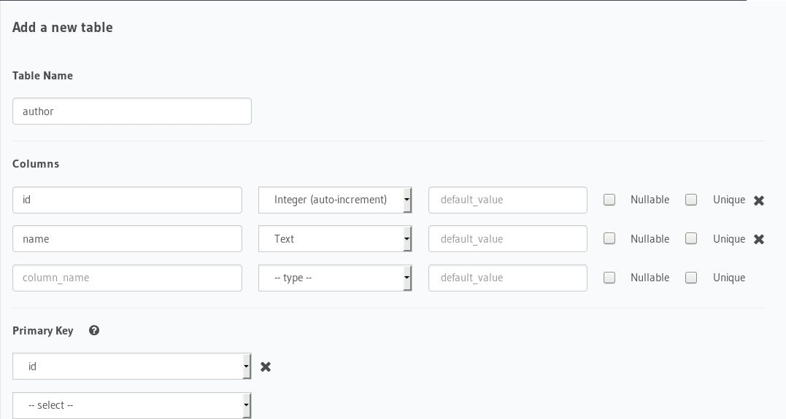
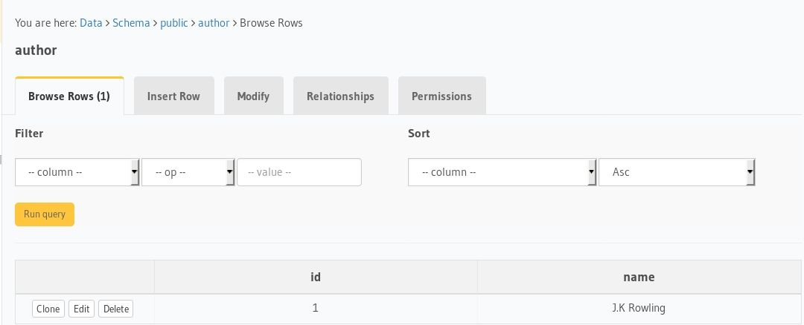
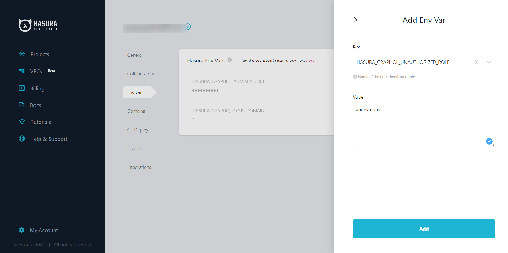
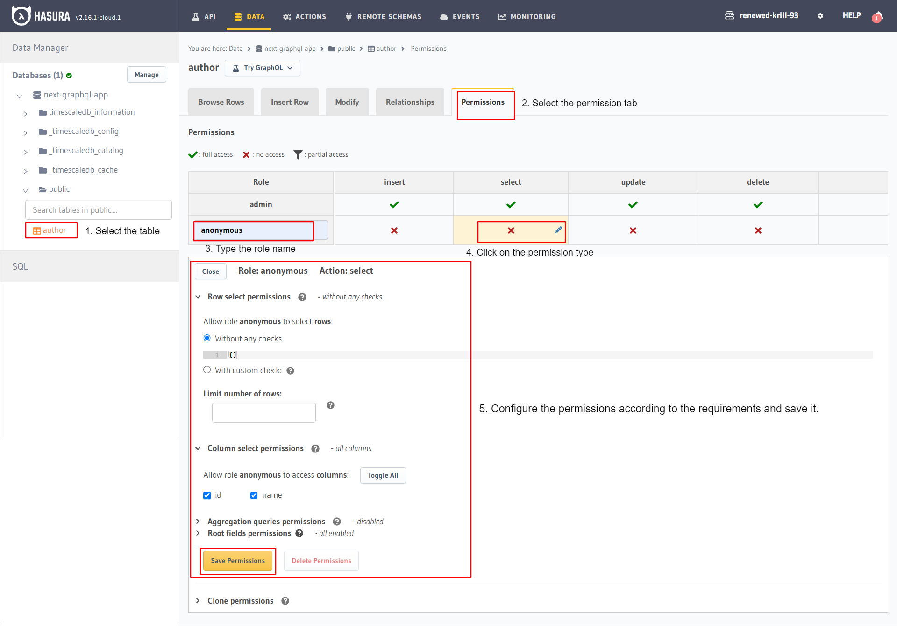

# nextjs-postgres-graphql

Boilerplate to get started with Nextjs, Hasura GraphQL engine as CMS and postgres as database using [Apollo Client](https://www.apollographql.com/apollo-clients).

[](https://codesandbox.io/s/next-apollo-2rffsi)


## Tutorial

- Deploy GraphQL Engine on Hasura Cloud and setup PostgreSQL via Heroku:

  [](https://cloud.hasura.io/signup)

- Get the GraphQL API URL for your Hasura app from settings (say `nextjs-graphql.hasura.app`)

- Create `author` table:

  Open Hasura console: visit <https://nextjs-graphql.hasura.app> on a browser  
  Navigate to `Data` section in the top nav bar and create a table as follows:

  

- Insert sample data into `author` table:

  

  Verify if the row is inserted successfully

  

- For accessing data from Hasura without `Admin Secret`, we need to create unauthorized role and set permission on that role. Below are the steps for creating the role and setting up the permission:

  1) Add a new variable `HASURA_GRAPHQL_UNAUTHORIZED_ROLE` and assign the value like `anonymous`. For more information read [this](https://hasura.io/docs/latest/deployment/graphql-engine-flags/reference/).
  

  1) Second step, assign the permission to the role that you created for unauthorized users (i.e. `anonymous`).
  

- Clone this repo:

  ```bash
  git clone https://github.com/hasura/sample-apps
  cd nextjs-postgres-graphql
  ```

- Install npm modules:

  ```bash
  npm install
  ```

- Rename the `.env.example` to `.env` and set the following variables

  - `NEXT_PUBLIC_HASURA_APP_URL`:- to your GraphQL API URL

- Create config.js as follows :
  - In the first step, we initialize ApolloClient by passing its constructor a configuration object with the `uri` and `cache`.

  - In the second step, we create the HOC component using the `withApollo` function that takes 2 inputs:
    1) a callback that returns the ApolloClient object.
    2) an object with a prop: `render` - used to wrap **your** pages with `<ApolloProvider>`

  ```jsx

  import withApollo from 'next-with-apollo';
  import { ApolloClient, ApolloProvider, InMemoryCache} from '@apollo/client';

  // creating the Apollo Client
  const client = new ApolloClient({
        uri: process.env.NEXT_PUBLIC_HASURA_APP_URL,  // <- Configure GraphQL Server URL (must be absolute)
        cache: new InMemoryCache(),
      });

  export default withApollo(
    () => {
      return client
    },
    {
      // providing the Apollo Client access to the pages
      render: ({ Page, props }) => {
        return (
          <ApolloProvider client={props.apollo}>
            <Page {...props} />
          </ApolloProvider>
        );
      }
    }
  );
  
  ```

- GraphQL query

  - GraphQL query

    ```graphql

    const QUERY = gql`
     query {
       author {
         id
         name
       }
     }
    `

    ```

  - Execute the `QUERY` query using the `useQuery` hook and fetch the Author data from the Hasura GraphQL server.

    ```jsx

    const Index = () => {
      const { data, loading, error } = useQuery(QUERY);

      if (loading) {
        return <h2>Loading...</h2>;
      }

      if (error) {
        return <h2>Error..</h2>;
      }

      return (
        <div>
          <h1>My Authors </h1>
          <AuthorList authors={data ? data.author : []} />
        </div>
      );
    };

    export default withApollo(Index);
    
    ```

- Run the app:

  ```bash
  npm run dev -- -p 8000
  ```

- Test the app
  Visit [http://localhost:8000](http://localhost:8000) to view the app

  

## Contributing

Checkout the [contributing guide](../../../CONTRIBUTING.md#community-content) for more details.
